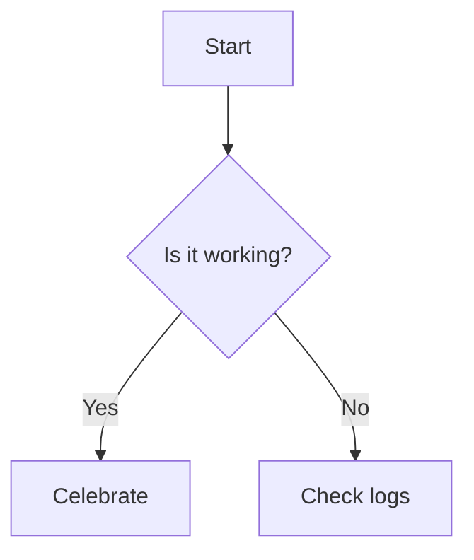

# Hero Example

```js
console.log('Hello, hero!');
```


```mermaid
graph TD;
  A[Start] --> B{Is it working?};
  B -- Yes --> C[Celebrate];
  B -- No --> D[Check logs];
```

An equation: $$E = mc^2$$

